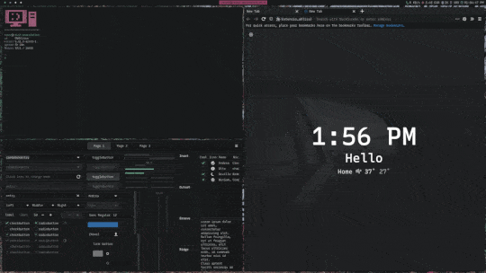

# Personal Dots: "OldbandT" 👕

## ⚠️ NO SUPPORT FILES GIVIN AS EXAMPLES ⚠️
## Aesthetic Insperation: Colorschemes such as

- [dracula/dracula-theme](https://github.com/dracula/dracula-theme)
- [arcticicestudio/nord](https://github.com/arcticicestudio/nord)
- [jolaleye/horizon-theme-vscode](https://github.com/jolaleye/horizon-theme-vscode)

the web extension [darkreader](https://darkreader.org/) and the faded Band T-shirt you bought at the Mall when you were younger for entirely too much money.

### 🔍 about, usecase, configs included:
i dont code very much personally mostly just fell in love with tiling window managers cuz i love to have all my windows visible or not opened at all. this setup is used mostly for

1.  Browsing
2.  Research
3.  Notes
4.  Photo editing
5.  Watching movies, shows, TV, Twitch

---

✍️ Configs included for: 
- [baskerville/bspwm](https://github.com/baskerville/bspwm)
- [dunst-project/dunst](https://github.com/dunst-project/dunst)
- [kovidgoyal/kitty](https://github.com/kovidgoyal/kitty)
- [jonaburg/picom](https://github.com/jonaburg/picom)
- [davatorium/rofi](https://github.com/davatorium/rofi)
- [kisom/surfraw](https://github.com/kisom/surfraw)
- [sxhkd/baskerville](https://github.com/baskerville/sxhkd) 

🖌️ tools used for generated themes:
- [themer.dev](https://themer.dev/?colors.dark.accent0=%239b5c78&colors.dark.accent1=%23ec9e9b&colors.dark.accent2=%2374ae93&colors.dark.accent3=%2374ae93&colors.dark.accent4=%236d959f&colors.dark.accent5=%23878a9b&colors.dark.accent6=%23a5b0b8&colors.dark.accent7=%23b294bb&colors.dark.shade0=%23181A1B&colors.dark.shade1=%23343637&colors.dark.shade2=%23515253&colors.dark.shade3=%236D6E6F&colors.dark.shade4=%23898A8A&colors.dark.shade5=%23A6A6A6&colors.dark.shade6=%23C2C2C2&colors.dark.shade7=%23D0D0D0&colors.light.accent0=%23F03E4D&colors.light.accent1=%23F37735&colors.light.accent2=%23EEBA21&colors.light.accent3=%2397BD2D&colors.light.accent4=%231FC598&colors.light.accent5=%2353A6E1&colors.light.accent6=%23BF65F0&colors.light.accent7=%23EE4EB8&colors.light.shade0=%23FFFCFF&colors.light.shade1=%23E0DCE0&colors.light.shade2=%23C1BCC2&colors.light.shade3=%23A29DA3&colors.light.shade4=%23847E85&colors.light.shade5=%23656066&colors.light.shade6=%23474247&colors.light.shade7=%23282629&activeColorSet=dark&calculateIntermediaryShades.dark=false&calculateIntermediaryShades.light=false)
- [themix-project/oomox](https://github.com/themix-project/oomox)

🖥️ other applications needed:
- [mkropat/jumpapp](https://github.com/mkropat/jumpapp)
- [loiccoyle/rofi-ttv](https://github.com/loiccoyle/rofi-ttv)
- [iwalton3/jellyfin-mpv-shim](https://github.com/iwalton3/jellyfin-mpv-shim)

### Special Notes
there are some special keystrokes for

-   Browsing/Research
-   Video playback

```
# search engines
super + shift + s
    ~/.config/rofi/scripts/websearch.sh

# internet bookmarks
super + shift + a
    ~/.config/rofi/scripts/bookmarks.sh

# twitch streams
super + shift + m
    rofi-ttv followed

# jellyfin server
super + shift + v
    jumpapp jellyfin-mpv-desktop

```
video playback is assigned to workspace 6
my setup is dual monitor tweak to your setup
im more than sure that there is extra steps needed to get these dots working like in
the screenshots but i am merely posting these files here as examples to grab
bits and pieces from.


